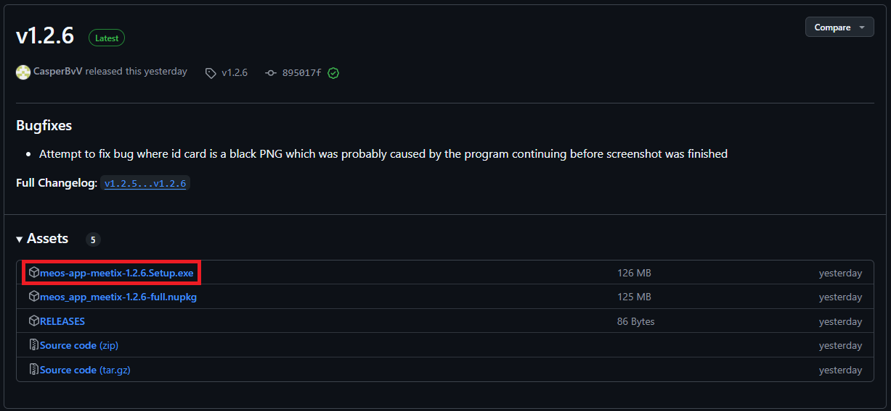
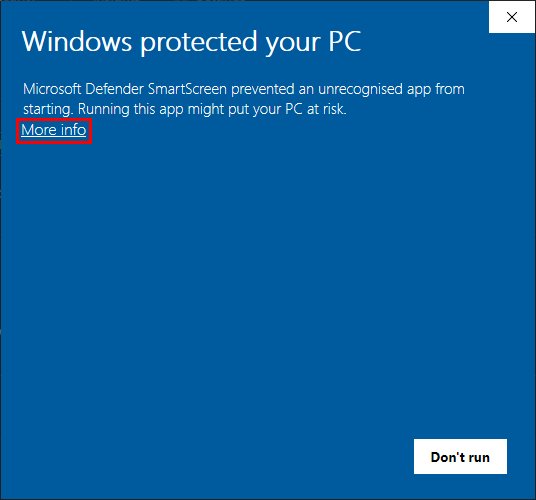
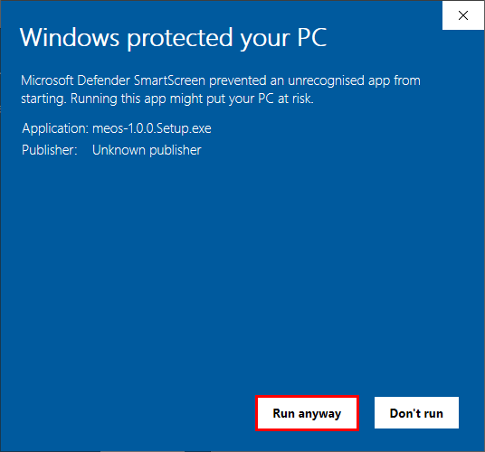

Met deze app kan je de [MEOS](https://meos.meetix.nl) op een makkelijke manier gebruiken als een desktop app. Ook zitter er een paar nieuwe features in die niet op de website te vinden zijn zoals een automatische ID-Scan en bookmarks voor belangrijke documenten.

# Hulp & Vragen
- Voor vragen of hulp, neem contact op met Casper B. (26-117) of maak [hier](https://github.com/CasperBvV/MEOS-App-Meetix/issues/new/choose) een issue aan

# Installatie

1. Download [hier](https://github.com/CasperBvV/MEOS-App-Meetix/releases/latest "Download pagina") de laatste versie van de MEOS
    - Download het bestand dat eindigt op `Setup.exe`
    
2. Open het bestand om de MEOS te installeren
3. Als je een beveiligings melding krijgt van Windows moet je op `Meer info` > `Alsnog uitvoeren` klikken.  
    - Deze melding krijg je doordat de software niet veel wordt gedownload een niet ondertekend is waardoor windows deze niet herkend  

# Disclaimer
- Deze app is op geen enkele manier geassocieerd met Politie Nederland
- Deze app is niet gemaakt door het Meetix Development team, ik sta hier volledig los van en heb dit gemaakt uit eigen initatief.
- Binnen deze app wordt de MEOS en verschillende documenten ingeladen vanaf https://meos.meetix.nl en https://sites.google.com, ik claim op geen enkele manier meegewerkt te hebben met het maken van deze site/documenten.
    - De dingen waar ik wel aan mee geholpen heb is allemaal te zien in de GitHub repository, hierin komt geen codering voor die gekopieerd is vanuit bovenstaande sites.
- Op alle codering die te vinden is in de GitHub repository rust auteursrecht, voor meer informatie zie [LICENSE](LICENSE.md)
